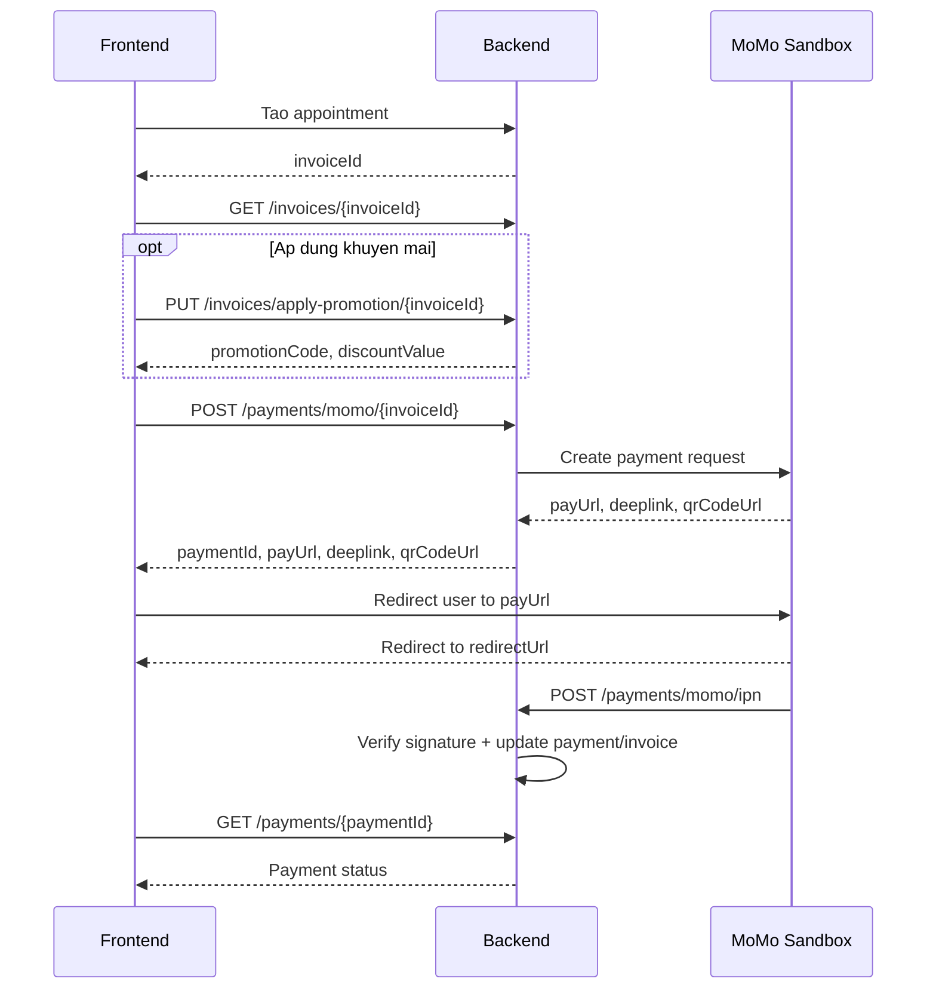

# Payment Flow - MoMo Sandbox

Tai lieu nay mo ta flow thanh toan hien tai cua backend voi MoMo sandbox.

Base URL local:

```text
http://localhost:8083/api
```

Ngrok sandbox dang dung:

```text
https://suffering-slider-anybody.ngrok-free.dev -> http://localhost:8083
```

IPN URL can cau hinh cho MoMo:

```text
https://suffering-slider-anybody.ngrok-free.dev/api/payments/momo/ipn
```

Luu y: vi backend co `server.servlet.context-path=/api`, IPN URL phai co `/api`.

## Tong Quan Flow



## Trang Thai

### Invoice

```text
UNPAID -> PAID
```

Invoice duoc tao sau khi confirm appointment thanh cong. Neu thanh toan MoMo thanh cong qua IPN, backend cap nhat invoice sang `PAID`.

### Payment

```text
PENDING -> PAID
PENDING -> FAILED
```

Khi goi API tao thanh toan MoMo, backend tao payment voi status `PENDING`. IPN cua MoMo la nguon xac thuc de cap nhat status cuoi.

## API 1: Xem Chi Tiet Invoice

Dung de FE hien thi thong tin hoa don truoc khi thanh toan.

```http
GET /api/invoices/{invoiceId}
```

Auth:

```text
Required
```

Response:

```json
{
  "success": true,
  "message": "Get invoice successfully",
  "data": {
    "invoiceId": "inv_001",
    "totalPrice": "450000.0",
    "createdAt": "2026-07-17T10:30:00",
    "invoiceStatus": "UNPAID",
    "serviceName": "Massage body",
    "categoryName": "Spa",
    "categoryColorTag": "#8B5CF6",
    "serviceDescription": "Relaxing massage service",
    "bookingDate": "2026-07-20",
    "startTime": "09:00:00",
    "appointmentStatus": "CONFIRMED",
    "endTime": "11:00:00",
    "promotionCode": "SPA50K",
    "discountValue": "50000.0",
    "duration": 120,
    "note": "Customer note",
    "serviceImage": "/images/uploads/services/ser_001.jpg",
    "staffName": "Nguyen Van A",
    "staffImage": "/images/uploads/users/staff_001.jpg",
    "staffSpecializations": ["Massage", "Body care"]
  }
}
```

## API 2: Ap Dung Khuyen Mai Cho Invoice

Dung truoc khi tao payment neu user co promotion code.

```http
PUT /api/invoices/apply-promotion/{invoiceId}
```

Auth:

```text
Required
```

Request body:

```json
{
  "promotionCode": "SPA50K"
}
```

Response:

```json
{
  "success": true,
  "message": "Apply promotion successfully",
  "data": {
    "promotionCode": "SPA50K",
    "discountValue": "50000.0"
  }
}
```

Ghi chu:

- `discountValue` la so tien duoc giam da tinh tren amount cua invoice.
- Neu promotion la percentage, backend tinh so tien giam tu phan tram do.
- Neu promotion la fixed amount, backend tra ve so tien giam co dinh hop le.

## API 3: Tao Thanh Toan MoMo

Dung de tao giao dich MoMo cho invoice.

```http
POST /api/payments/momo/{invoiceId}
```

Auth:

```text
Required
```

Request body:

```text
Khong co
```

Backend xu ly:

1. Lay current user tu security context.
2. Tim invoice theo `invoiceId` va user hien tai.
3. Chi cho tao payment neu invoice dang `UNPAID`.
4. Lay amount hien tai cua invoice, bao gom ca promotion neu da apply.
5. Tao payment status `PENDING`, method `MOMO`.
6. Tao `orderId` va `requestId`.
7. Ky chu ky HMAC SHA256 bang MoMo secret key.
8. Goi MoMo create payment endpoint.
9. Neu MoMo tra `resultCode = 0`, luu payment va tra link thanh toan ve FE.

Response:

```json
{
  "success": true,
  "message": "Create MoMo payment successfully",
  "data": {
    "paymentId": "pay_1783060546358",
    "invoiceId": "inv_001",
    "orderId": "pay_1783060546358",
    "requestId": "req_1783060546358",
    "payUrl": "https://test-payment.momo.vn/v2/gateway/pay?t=...",
    "deeplink": "momo://app?...",
    "qrCodeUrl": "https://test-payment.momo.vn/v2/gateway/qr?..."
  }
}
```

FE xu ly:

1. Luu `paymentId`, `invoiceId`, `orderId`, `requestId` tam thoi o state.
2. Redirect user sang `payUrl`, hoac hien QR tu `qrCodeUrl`.
3. Sau khi user quay lai trang result, FE goi API check status payment.

## API 4: MoMo IPN Callback

Endpoint nay de MoMo goi ve backend, FE khong can goi truc tiep.

```http
POST /api/payments/momo/ipn
```

Auth:

```text
Public, nhung backend bat buoc verify signature
```

Request body MoMo gui ve:

```json
{
  "partnerCode": "MOMO",
  "orderId": "pay_1783060546358",
  "requestId": "req_1783060546358",
  "amount": 450000,
  "orderInfo": "Payment for invoice inv_001",
  "orderType": "momo_wallet",
  "transId": 123456789,
  "resultCode": 0,
  "message": "Successful.",
  "payType": "qr",
  "responseTime": 1783060546358,
  "extraData": "",
  "signature": "..."
}
```

Backend xu ly:

1. Tao raw data theo dung thu tu field MoMo yeu cau.
2. Verify `signature` bang secret key.
3. Tim payment theo `orderId` va `requestId`.
4. Kiem tra `amount` IPN bang amount cua payment.
5. Neu `resultCode = 0`:
   - Cap nhat payment status thanh `PAID`.
   - Cap nhat invoice status thanh `PAID`.
6. Neu `resultCode != 0` va payment chua `PAID`:
   - Cap nhat payment status thanh `FAILED`.
   - Invoice van giu `UNPAID`.

Response:

```json
{
  "success": true,
  "message": "Handle MoMo IPN successfully",
  "data": null
}
```

Quan trong:

- Redirect ve FE khong phai bang chung thanh toan thanh cong.
- IPN moi la nguon dung de backend cap nhat payment va invoice.
- Endpoint IPN public la dung, vi MoMo can goi tu ben ngoai, nhung bat buoc verify signature.

## API 5: Lay Trang Thai Payment Theo Payment ID

Dung cho FE sau khi user quay lai trang result.

```http
GET /api/payments/{paymentId}
```

Auth:

```text
Required
```

Response:

```json
{
  "success": true,
  "message": "Get payment successfully",
  "data": {
    "paymentId": "pay_1783060546358",
    "invoiceId": "inv_001",
    "amount": 450000.0,
    "paymentMethod": "MOMO",
    "status": "PAID",
    "orderId": "pay_1783060546358",
    "requestId": "req_1783060546358",
    "paymentDate": "2026-07-17T10:35:00"
  }
}
```

## API 6: Lay Payment Moi Nhat Cua Invoice

Dung khi FE chi con `invoiceId`, hoac user reload trang result.

```http
GET /api/payments/invoice/{invoiceId}/latest
```

Auth:

```text
Required
```

Response:

```json
{
  "success": true,
  "message": "Get payment successfully",
  "data": {
    "paymentId": "pay_1783060546358",
    "invoiceId": "inv_001",
    "amount": 450000.0,
    "paymentMethod": "MOMO",
    "status": "PENDING",
    "orderId": "pay_1783060546358",
    "requestId": "req_1783060546358",
    "paymentDate": "2026-07-17T10:35:00"
  }
}
```

## Flow De Xuat Cho Frontend

### Trang invoice/payment

1. FE nhan `invoiceId` sau khi tao appointment thanh cong.
2. Goi `GET /api/invoices/{invoiceId}` de hien thi invoice.
3. Neu user nhap promotion:
   - Goi `PUT /api/invoices/apply-promotion/{invoiceId}`.
   - Goi lai `GET /api/invoices/{invoiceId}` neu can refresh amount.
4. User chon MoMo:
   - Goi `POST /api/payments/momo/{invoiceId}`.
   - Redirect sang `payUrl`.

### Trang payment result

1. User quay lai FE qua `redirect-url`.
2. FE khong ket luan thanh cong/thatan bai chi dua vao query params redirect.
3. FE goi:
   - `GET /api/payments/{paymentId}` neu con paymentId trong state/storage.
   - Hoac `GET /api/payments/invoice/{invoiceId}/latest` neu chi con invoiceId.
4. Neu status:
   - `PAID`: hien thi thanh toan thanh cong.
   - `FAILED`: hien thi thanh toan that bai, cho phep thanh toan lai.
   - `PENDING`: hien thi dang xu ly va polling lai sau vai giay.

## Cau Hinh MoMo Sandbox

Local config hien tai:

```yaml
momo:
  endpoint: https://test-payment.momo.vn/v2/gateway/api/create
  partner-code: MOMO
  access-key: F8BBA842ECF85
  secret-key: K951B6PE1waDMi640xX08PD3vg6EkVlz
  redirect-url: http://localhost:5173/payment/result
  ipn-url: https://suffering-slider-anybody.ngrok-free.dev/api/payments/momo/ipn
  request-type: captureWallet
```

Production/docker nen dung bien moi truong:

```text
MOMO_ENDPOINT
MOMO_PARTNER_CODE
MOMO_ACCESS_KEY
MOMO_SECRET_KEY
MOMO_REDIRECT_URL
MOMO_IPN_URL
MOMO_REQUEST_TYPE
```

## Luu Y Khi Test

- Phai giu ngrok dang chay, neu restart ngrok free thi URL co the doi.
- Neu URL ngrok doi, cap nhat lai `momo.ipn-url`.
- MoMo amount la VND integer, backend dang round amount cua invoice khi gui sang MoMo.
- Neu IPN khong ve, payment co the van `PENDING`.
- Hien tai backend cho phep tao payment moi cho cung invoice neu invoice van `UNPAID`; FE nen uu tien check latest payment truoc khi tao payment moi neu muon tranh tao nhieu giao dich pending.

